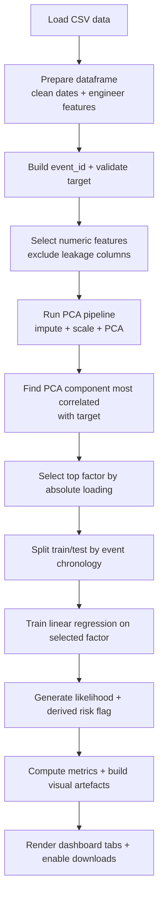

# Analytical Approach

## Contents
- [1. Technology Behind the Program](#1-technology-behind-the-program)
  - [1a. Workflow Flowchart](#1a-workflow-flowchart)
  - [1b. PCA Analysis](#1b-pca-analysis)
  - [1c. ML Model and Techniques Used](#1c-ml-model-and-techniques-used)
- [2. How the Dashboard Works](#2-how-the-dashboard-works)
  - [2.1 Data Ingestion and Preparation](#21-data-ingestion-and-preparation)
  - [2.2 Workflow Execution Engine](#22-workflow-execution-engine)
  - [2.3 Persona-Based Views and Visual Outputs](#23-persona-based-views-and-visual-outputs)
  - [2.4 Interactive Filtering Layer](#24-interactive-filtering-layer)
  - [2.5 Technical Diagnostics Modal](#25-technical-diagnostics-modal)
  - [2.6 External Prompt Files and Narrative Generation](#26-external-prompt-files-and-narrative-generation)
  - [2.7 CSV Export and Persistence](#27-csv-export-and-persistence)

## 1. Technology Behind the Program

The program combines feature engineering, dimensionality reduction, and supervised learning into a forecast-risk analysis workflow. The core implementation spans:

- `main.py` as the unified entrypoint for workflows and dashboards.
- `pca_analysis.py` for data cleaning and PCA feature processing.
- `pca_linear_workflow.py` for end-to-end PCA factor selection + linear model training/testing.
- `forecast_failure_model.py` for a logistic-regression alternative using categorical and numeric features.
- `plotly_pca_linear_upload_dashboard.py` for interactive business-facing analytics and controls.
- `prompts/` for external persona system prompts used by AI-generated summaries.

At a high level, the system is designed to:

1. Build forecast-time-safe engineered features.
2. Reduce feature complexity using PCA.
3. Identify the most influential business factor from PCA loadings.
4. Train/test a model that predicts risk likelihood.
5. Present decision-ready outputs in a multi-view Dash interface.
6. Load persona-specific summary instructions from external prompt files so narrative behaviour can be updated without editing Python source.

### 1a. Workflow Flowchart

Key workflow functions:
- `main()` in `main.py` for unified command routing.
- `run_workflow(...)` in `plotly_pca_linear_upload_dashboard.py`
- `find_influential_factor(...)` in `pca_linear_workflow.py`
- `train_test_linear(...)` in `pca_linear_workflow.py`

### 1b. PCA Analysis

Useful PCA references:

- [scikit-learn PCA documentation](https://scikit-learn.org/stable/modules/generated/sklearn.decomposition.PCA.html)
- [IBM PCA overview](https://www.ibm.com/think/topics/principal-component-analysis)
- [StatQuest PCA intuition video series](https://www.youtube.com/results?search_query=statquest+pca)

How PCA works in this program:

- Numeric features are median-imputed (`SimpleImputer`) to handle missing values.
- Features are standardized (`StandardScaler`) so PCA is not dominated by scale differences.
- PCA transforms the original correlated variables into principal components (`PC1`, `PC2`, ...).
- The workflow keeps either:
  - a fixed number of components, or
  - enough components to explain a target variance (default is `0.95`, i.e., 95% explained variance).

How PCA is used to train the model:

- The workflow calculates the correlation between each component score and the selected target column.
- It selects the component with the strongest absolute correlation to the target.
- It then selects the original feature with the largest absolute loading on that component.
- That selected feature becomes the single input to the downstream linear regression model.

This approach keeps the model simple and interpretable while still using PCA to identify the most informative signal.

### 1c. ML Model and Techniques Used

The codebase currently exposes two modeling patterns.

1. **PCA + Linear Regression path** (`pca_linear_workflow.py`)
   - Uses PCA to choose one influential factor.
   - Trains `LinearRegression` on that factor.
   - Clips predictions to `[0, 1]` to represent failure likelihood.
   - Produces regression metrics (`MAE`, `RMSE`, `R2`) and optionally `ROC AUC` when target is binary.
   - Uses thresholding to derive a binary at-risk flag.

2. **Logistic Regression path** (`forecast_failure_model.py`)
   - Uses a full feature pipeline with:
     - `ColumnTransformer`
     - categorical branch: imputation + `OneHotEncoder`
     - numeric branch: imputation + `StandardScaler`
   - Trains `LogisticRegression` (`class_weight='balanced'`, solver `lbfgs`) for classification.
   - Outputs calibrated classification-style probabilities and model diagnostics (`ROC AUC`, precision, Brier score, classification report).

Additional technical techniques used:

- **Forecast-time-safe feature engineering** to reduce leakage risk.
- **Event-based chronological split** (`event_id` + `Forecast_Period_End_Date`) to mimic realistic train/test ordering.
- **Probability thresholding** to convert continuous risk into business-operational alert bands.

## 2. How the Dashboard Works

The main production UI is implemented in `plotly_pca_linear_upload_dashboard.py` using Dash + Plotly. It is structured as a callback-driven application with persisted client-side state (`dcc.Store`).

The application is launched through the unified CLI in `main.py`, while the dashboard itself orchestrates modelling, filtering, and persona-specific rendering inside `build_graphs(...)`.

### 2.1 Data Ingestion and Preparation

The dashboard supports:
- Uploading a CSV (`dcc.Upload`), or
- Falling back to default data (`data/forecast_data.csv`) when no upload is provided.

Processing steps:
- Decode upload payload (`decode_uploaded_csv`).
- Enrich dataframe with engineered and supplier-derived features (`prepare_dataframe`, `enrich_with_supplier_attributes`).
- Auto-generate `event_id` where possible (`ensure_event_id`).
- Build selectable target options from numeric-compatible columns (`target_options_from_df`).

### 2.2 Workflow Execution Engine

When the user clicks **Run workflow**, callback `run_model(...)`:

1. Reads the prepared dataset from `dataset-store`.
2. Executes `run_workflow(...)` with:
   - fixed PCA variance target (`FIXED_N_COMPONENTS = 0.95`),
   - user-controlled train window (`train-frac`),
   - user-controlled risk threshold (`threshold`).
3. Produces:
   - PCA explained variance and loadings,
   - selected component/factor metadata,
   - predictions and metrics.
4. Stores outputs in:
   - `predictions-store` (prediction dataframe),
   - `workflow-store` (serialized full workflow result).

### 2.3 Persona-Based Views and Visual Outputs

The central visuals are grouped into business personas via `dcc.Tabs`:

- **Programme Director**: headline KPIs, next-period outlook, top business drivers, recommendations.
- **Commercial Manager**: supplier/contract/profile risk comparisons, a region-by-contract interaction heatmap, and a supplier watchlist that now shows the top 5 highest-risk and top 5 lowest-risk suppliers.
- **CFO**: risk-adjusted spend, concentration across programmes, and a spend-versus-failed-proposal chart with a best-fit trendline plus narrative annotation to help explain the relationship.
- **Project Controls Lead**: trend diagnostics, process-stability indicators, and top risk-driver explanations.

Visuals are generated in `build_graphs(...)`, with chart-specific helper functions for bar charts, heatmaps, trend lines, and risk summaries.

Notable current dashboard behaviour:

- The previous supplier-region risk-pair chart has been removed because it did not materially extend the insight already provided elsewhere.
- Persona AI summaries load instructions from external prompt files in `prompts/`, one file per persona.
- Recommendation prompts remain target-aware and are stored under `prompts/` as well.

### 2.4 Interactive Filtering Layer

After a run, a filter section is shown to refine the current view without rerunning model training:

- `Programme_ID`
- `Region`
- `Contract_Type`
- `Supplier_Profile`
- Minimum predicted risk cutoff

Filtering behavior is handled by `refresh_graphs_for_programme(...)`, which re-renders graphs from `workflow-store` and current filter selections.

### 2.5 Technical Diagnostics Modal

To keep executive UX clean while preserving transparency for technical teams:

- Detailed metrics are stored in hidden preformatted text (`metrics`).
- A modal can be opened/closed via `toggle_tech_modal(...)`.
- The modal shows full workflow metric JSON and diagnostics content.

This creates a business-first experience while keeping implementation details accessible on demand.

### 2.6 External Prompt Files and Narrative Generation

Persona summaries are driven by external prompt files under `prompts/`:

- `system_prompt_persona_programme_director.txt`
- `system_prompt_persona_commercial_manager.txt`
- `system_prompt_persona_cfo.txt`
- `system_prompt_persona_project_controls.txt`

These prompts position the AI component as a data analyst for the relevant persona and instruct it to explain:

- what is going well,
- what is not going well, and
- what actions are needed to stay on track.

This design makes prompt tuning operationally simpler because summary behaviour can be adjusted without changing the dashboard code.

### 2.7 CSV Export and Persistence

The dashboard supports download of the latest prediction table:

- Button: `download-button`
- Callback: `download_predictions(...)`
- Output: `workflow_linear_predictions_uploaded.csv`

State persistence via `dcc.Store` (`dataset-store`, `predictions-store`, `workflow-store`) allows cross-callback coordination without recomputing everything on every UI action.

